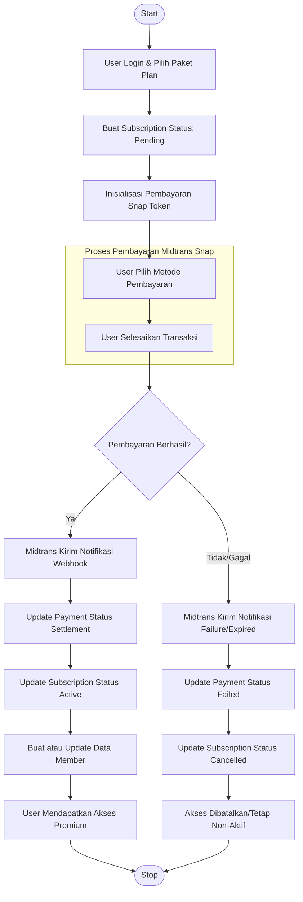
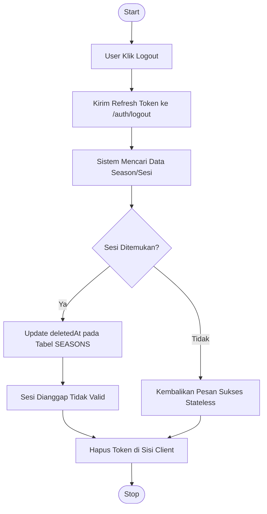

# Activity Diagram: Alur Berlangganan

Diagram ini menunjukkan alur aktivitas dari saat pengguna memilih paket hingga menjadi member aktif melalui integrasi Midtrans.

## Detail Tahapan:
1.  **Pilih Paket**: User mengakses endpoint `/plans` untuk melihat daftar paket.
2.  **Buat Subscription**: User mengirim `planId` ke `/subscriptions`. Sistem mencatat niat langganan.
3.  **Bayar**: Sistem mengarahkan user ke antarmuka Snap Midtrans.
4.  **Webhook**: Bagian terpenting di mana server Anda menerima konfirmasi dari Midtrans secara asinkron.
5.  **Akses Member**: Hanya setelah pembayaran `settlement`, data user di tabel `Member` akan diaktifkan.

---

# Activity Diagram: Logout & Session Cleanup

Diagram ini menunjukkan apa yang terjadi ketika user melakukan logout dengan sistem **Soft Delete**.

