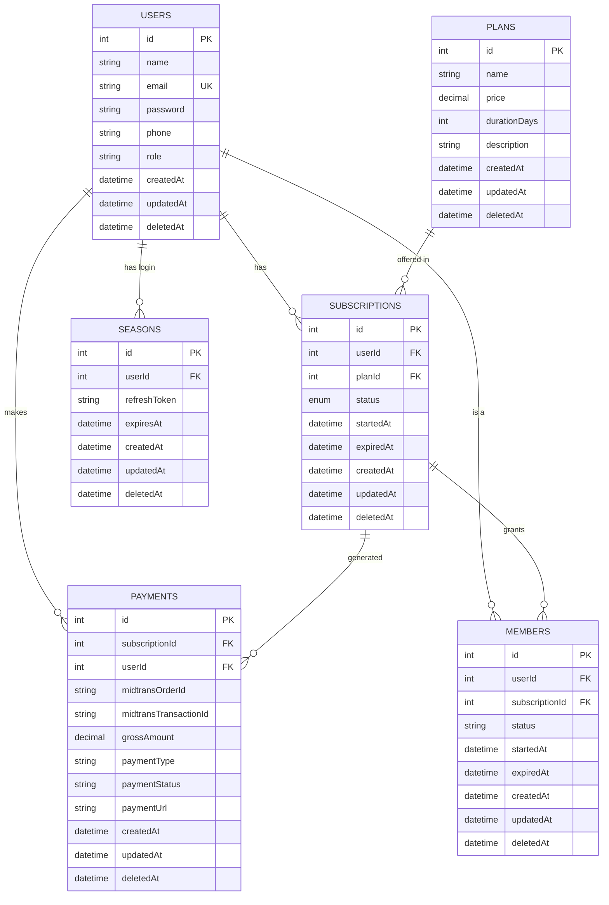

# Entity Relationship Diagram (ERD)

Berikut adalah diagram hubungan antar entitas (ERD) untuk proyek **Subscribe**. Diagram ini mencerminkan struktur database terbaru termasuk dukungan **Soft Delete** (`deletedAt`) dan relasi **Foreign Key**.

## Penjelasan Relasi:
1.  **User**: Entitas pusat. Satu user bisa memiliki banyak subscription, banyak history payment, dan banyak session login (seasons).
2.  **Plan**: Daftar paket yang tersedia. Hubungan ke `Subscription` bersifat *one-to-many* (satu plan bisa diambil banyak user).
3.  **Subscription**: Menghubungkan User dengan Plan. Statusnya (`pending`, `active`, dll) menentukan akses user.
4.  **Payment**: Setiap transaksi pembayaran dicatat di sini dan terhubung ke `Subscription` terkait.
5.  **Member**: Representasi keanggotaan aktif hasil dari subscription yang sudah dibayar.
6.  **Season**: Digunakan untuk manajemen sistem login (Refresh Token).

## Catatan Teknis:
- Semua tabel sekarang memiliki kolom `deletedAt` untuk mendukung fiture **Soft Delete**.
- Semua relasi menggunakan **Foreign Key** dengan aturan `ON DELETE RESTRICT` untuk menjaga integritas data transaksi.
